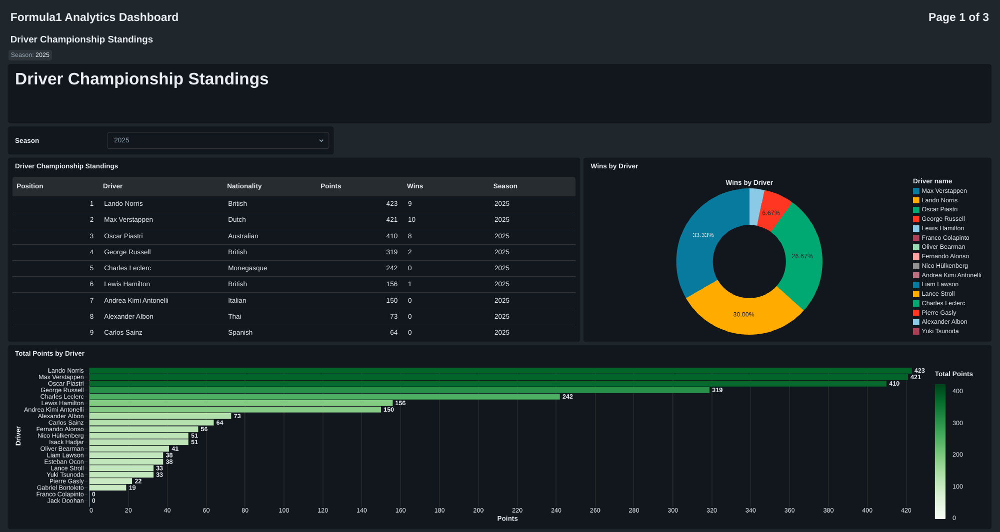
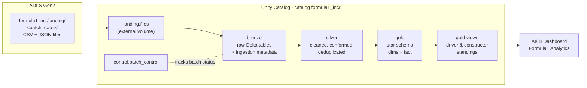
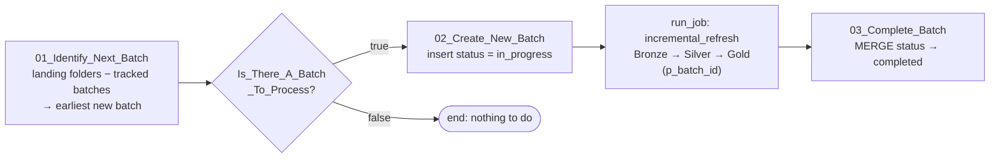
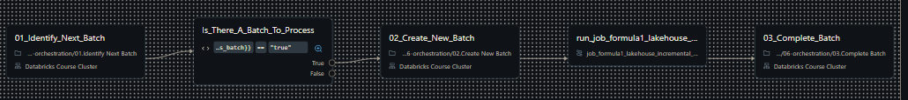
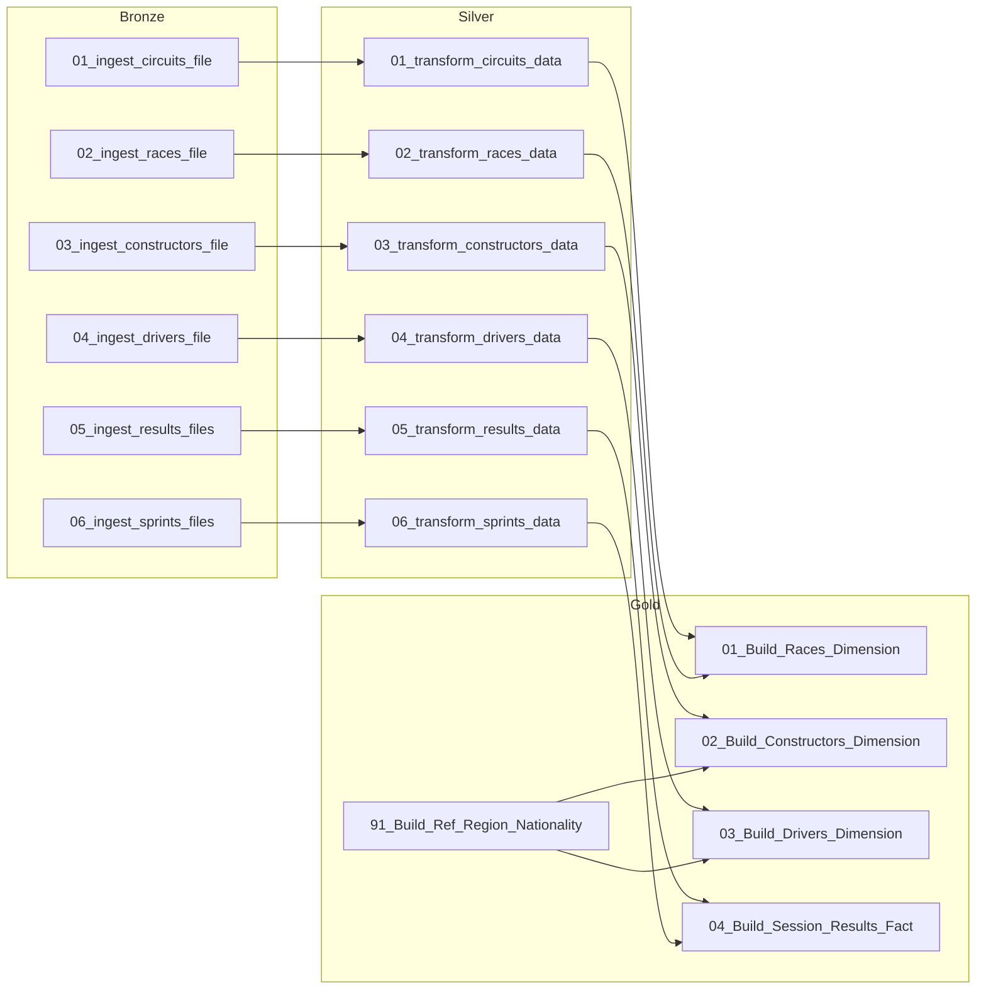
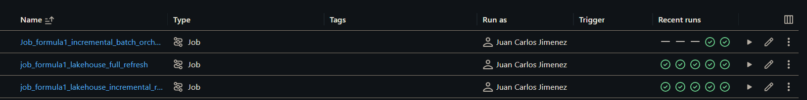
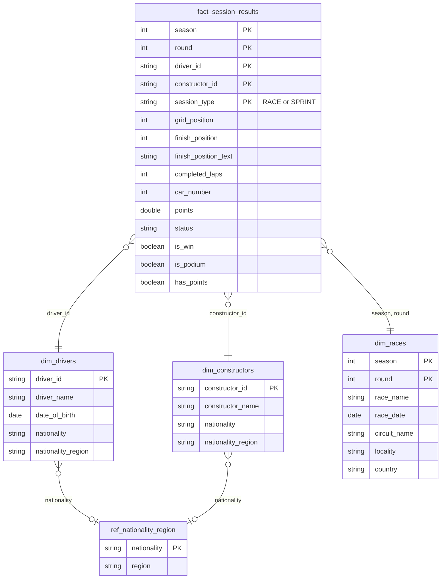
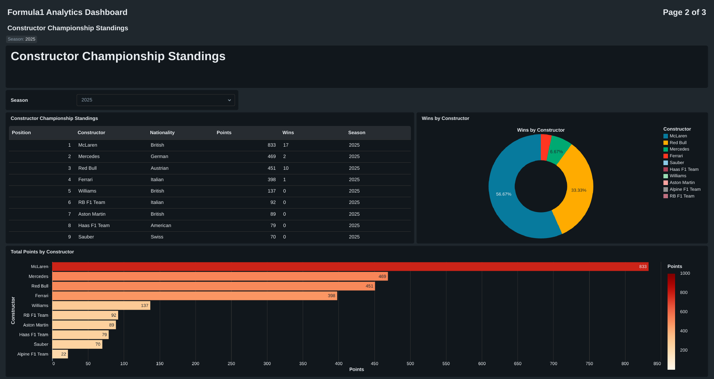
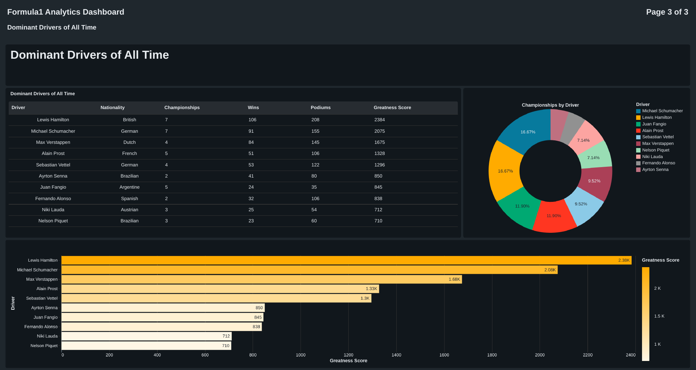

# Formula 1 Lakehouse on Azure Databricks — Incremental Batch Processing


An end-to-end data engineering project that builds a **medallion lakehouse (Bronze → Silver → Gold)** for Formula 1 racing data on **Azure Databricks**, governed by **Unity Catalog** and stored as **Delta Lake** tables in **ADLS Gen2**.

New data arrives as **date-based batches** in a landing zone. A **control-table-driven orchestration job** detects the next unprocessed batch, runs the transformation pipeline as a **child job**, and records the batch's status. All writes are **idempotent**: re-running a batch never creates duplicates. The curated star schema feeds an **AI/BI dashboard** with season standings and an all-time "dominant drivers" ranking.



---

## Table of Contents

- [Highlights](#highlights)
- [Architecture](#architecture)
- [Tech Stack](#tech-stack)
- [Repository Structure](#repository-structure)
- [Source Data](#source-data)
- [Unity Catalog Layout](#unity-catalog-layout)
- [Pipeline Layers](#pipeline-layers)
- [Incremental Processing & Orchestration](#incremental-processing--orchestration)
- [Jobs](#jobs)
- [Gold Data Model](#gold-data-model)
- [Analytics & Dashboard](#analytics--dashboard)
- [How to Reproduce](#how-to-reproduce)
- [Project Evolution](#project-evolution)
- [Acknowledgments](#acknowledgments)
- [Author](#author)

---

## Highlights

- **Medallion architecture** with Bronze, Silver and Gold schemas, each on its own managed location in ADLS Gen2.
- **Batch-aware incremental loads.** Every record carries a `batch_id`, and each layer processes only the batch currently being loaded.
- **Idempotent writes at every layer.**
  - Bronze: partition overwrite with `replaceWhere` on `batch_id`.
  - Silver and Gold: Delta `MERGE` (upsert) on business keys.
- **Out-of-order protection in Silver.** A matched row is updated only when `source.batch_id >= target.batch_id`, so an older batch cannot overwrite newer data.
- **Control-table orchestration.** The `control.batch_control` table tracks each batch as `in_progress` or `completed`. A condition task skips the run when there is nothing new to process.
- **Parent/child jobs.** The orchestration job passes `p_batch_id` to the pipeline job through task values and job parameters.
- **Reusable helpers.** Shared functions handle ingestion metadata and Bronze, Silver and Gold writes, so each notebook contains only its own business logic.
- **Explicit schemas and `FAILFAST` reads**, covering CSV, single-line JSON, nested JSON and multi-line JSON.
- **Star schema in Gold**: three dimensions, a fact table that unifies Race and Sprint sessions, and a curated reference table.
- **Cost-aware compute.** The pipeline runs on a single-node job cluster using Azure Spot instances with on-demand fallback.

---

## Architecture



**Storage access:** an Azure Databricks Access Connector backs the Unity Catalog **storage credential**, which secures an **external location** over the ADLS Gen2 container. The code refers only to Unity Catalog objects and `abfss://` paths. No account keys or secrets appear in any notebook.

---

## Tech Stack

| Area | Technology |
|---|---|
| Platform | Azure Databricks (Runtime 17.3 LTS) |
| Storage | Azure Data Lake Storage Gen2 |
| Table format | Delta Lake (MERGE, `replaceWhere`, partitioning) |
| Governance | Unity Catalog: catalog, schemas, external location, storage credential, external volume |
| Processing | PySpark DataFrame API, Spark SQL |
| Orchestration | Databricks Jobs: notebook tasks, condition task, run-job task, task values, job parameters |
| Visualization | Databricks AI/BI Dashboards |

---

## Repository Structure

```
formula1-databricks-lakehouse/
├── README.md
├── formula1_project_incremental_loads/       # Databricks notebooks (source format)
│   ├── 00-common/
│   │   ├── 01.environment-config.py          # catalog / schema names, landing path
│   │   ├── 02.bronze-helpers.py              # add_ingetion_metadata(), write_to_bronze()
│   │   ├── 03.silver-helpers.sql             # write_to_silver()  (MERGE with batch guard)
│   │   └── 04.gold-helpers.sql               # write_to_gold()    (MERGE upsert)
│   ├── 01-setup/
│   │   └── 01.Setup Project Environment.py   # external location, catalog, schemas, volume
│   ├── 02-bronze/                            # 6 ingestion notebooks
│   ├── 03.silver/                            # 6 transformation notebooks
│   ├── 04.gold/                              # 3 dimensions, 1 fact, 1 reference table
│   ├── 05.analytics/                         # standings views (SQL)
│   └── 06-orchestration/                     # control table + batch lifecycle notebooks
├── jobs/                                     # Databricks job definitions (YAML)
│   ├── job_formula1_lakehouse_batch_orchestration.yml
│   ├── formula1_lakehouse_incremental_refresh.yml
│   └── formula1_lakehouse_full_refresh.yml   # v1 (full refresh), kept for reference
├── dashboards/
│   ├── Formula1 Analytics Dashboard.lvdash.json
│   └── *.pdf                                 # exported dashboard pages
└── docs/images/                              # screenshots used in this README
```

> The notebooks are exported in Databricks **source format**. `# COMMAND ----------` separates cells and `# MAGIC` marks `%md` / `%sql` / `%run` cells. Importing the folder into a workspace restores the original notebooks.

---

## Source Data

The course provided the dataset. It contains historical Formula 1 data split into **batches, one folder per date**, under the landing volume:

```
/Volumes/formula1_incr/landing/files/
└── <batch_date>/
    ├── circuits.csv
    ├── races.csv
    ├── constructors.json
    ├── drivers.json
    ├── results_*.json
    └── sprints_*.json
```

| File(s) | Format | Notes |
|---|---|---|
| `circuits.csv` | CSV with header | latitude/longitude as `DOUBLE` |
| `races.csv` | CSV with header | one row per season + round |
| `constructors.json` | Single-line JSON | |
| `drivers.json` | Nested JSON | `name` is a struct (`givenName`, `familyName`) |
| `results_*.json` | Single-line JSON, multiple files | race results per driver |
| `sprints_*.json` | **Multi-line** JSON, multiple files | read with `multiLine = true` |

The `results_*` and `sprints_*` files are moved into their own sub-folders inside the batch before they are read, so each reader loads one consistent set of files.

---

## Unity Catalog Layout

| Object | Name | Purpose |
|---|---|---|
| External location | `databricks_course_ext_dl_formula1_incr` | Secures the ADLS Gen2 container |
| Catalog | `formula1_incr` | Project catalog (managed location on ADLS) |
| Schema | `landing` | Holds the external volume `files` |
| Schema | `bronze` | Raw tables, partitioned by `batch_id` |
| Schema | `silver` | Cleaned and conformed tables |
| Schema | `gold` | Star schema, reference table and analytics views |
| Schema | `control` | `batch_control` table for orchestration |

---

## Pipeline Layers

### Bronze: raw ingestion

`02-bronze/01–06`. Each notebook receives `p_batch_id` as a widget/job parameter and:

1. Reads the file(s) for that batch with an **explicit schema** and `mode = FAILFAST`.
2. Adds metadata columns `ingestion_timestamp` and `source_file` (from `_metadata.file_path`).
3. Writes to a Delta table **partitioned by `batch_id`**, overwriting only that partition:

```python
final_df.write.format("delta") \
    .mode("overwrite") \
    .partitionBy("batch_id") \
    .option("replaceWhere", f"batch_id = '{batch_id}'") \
    .saveAsTable(table_name)
```

Re-running a batch replaces its own partition and leaves every other batch untouched.

### Silver: cleansing and conformance

`03.silver/01–06`. Each notebook reads **only the current batch** from Bronze and applies:

- **Column selection**: drops columns not needed for analytics, such as `url`.
- **snake_case renaming** with business-friendly names (`lat → latitude`, `grid → grid_position`, `position → finish_position`, `laps → completed_laps`, …).
- **Business-key validation**: drops rows with null keys.
- **Deduplication** on business keys.
- **Standardization** with `initcap` on names, localities and nationalities. For drivers, the nested name struct is flattened into `driver_name`.
- **Audit columns** `created_timestamp` / `updated_timestamp`.

Rows are then **upserted** with a shared `write_to_silver()` helper. The update guard is the key detail:

```python
delta_table.alias("t").merge(final_df.alias("s"), merge_condition) \
    .whenMatchedUpdate(condition="s.batch_id >= t.batch_id", set=update_map) \
    .whenNotMatchedInsertAll() \
    .execute()
```

| Silver table | Business key |
|---|---|
| `circuits` | `circuit_id` |
| `races` | `season`, `round` |
| `constructors` | `constructor_id` |
| `drivers` | `driver_id` |
| `results` | `season`, `round`, `constructor_id`, `driver_id` |
| `sprints` | `season`, `round`, `constructor_id`, `driver_id` |

### Gold: dimensional model

`04.gold/`. Builds a star schema from the current batch and upserts it with `write_to_gold()`. Details are in the [Gold Data Model](#gold-data-model) section.

### Analytics: semantic views

`05.analytics/`. SQL views aggregate the fact table per season and rank drivers and constructors with
`RANK() OVER (PARTITION BY season ORDER BY total_points DESC, number_of_wins DESC)`.

---

## Incremental Processing & Orchestration

The orchestration job runs the full lifecycle of one batch:





**How it works**

1. **`01.Identify Next Batch`** lists the batch folders in the landing volume and subtracts the batches already recorded in `control.batch_control` (status `in_progress` or `completed`). It selects the **earliest** remaining batch and publishes two **task values**: `p_batch_id` and `has_batch`.
2. **`Is_There_A_Batch_To_Process`** is a **condition task** (`has_batch == "true"`). If there is no new batch, the run ends without starting the pipeline.
3. **`02.Create New Batch`** appends a row with status `in_progress`.
4. **`run_job`** triggers the pipeline job `job_formula1_lakehouse_incremental_refresh` as a **child job**, forwarding `p_batch_id` as a job parameter.
5. **`03.Complete Batch`** uses a Delta `MERGE` to switch the batch to `completed`.

Batches therefore load **one at a time and in chronological order**. Because the job **queue** is enabled, overlapping triggers wait instead of running concurrently.

**Control table**

```sql
CREATE TABLE IF NOT EXISTS formula1_incr.control.batch_control (
  batch_id          STRING,
  status            STRING,     -- in_progress | completed
  created_timestamp TIMESTAMP,
  updated_timestamp TIMESTAMP
);
```

### Incremental pipeline DAG (child job)



The six entity branches have no dependencies on each other and run **in parallel**. Each Gold task waits only for its own upstream Silver tasks.

---

## Jobs

| Job | Definition | Role |
|---|---|---|
| `Job_formula1_incremental_batch_orchestration` | [`jobs/job_formula1_lakehouse_batch_orchestration.yml`](jobs/job_formula1_lakehouse_batch_orchestration.yml) | Parent job: batch detection, control table, triggers the pipeline |
| `job_formula1_lakehouse_incremental_refresh` | [`jobs/formula1_lakehouse_incremental_refresh.yml`](jobs/formula1_lakehouse_incremental_refresh.yml) | Child job: Bronze → Silver → Gold for one `p_batch_id` |
| `job_formula1_lakehouse_full_refresh` | [`jobs/formula1_lakehouse_full_refresh.yml`](jobs/formula1_lakehouse_full_refresh.yml) | v1 of the project (full reload), kept for reference |

**Pipeline compute:** a single-node job cluster (`Standard_D4ds_v4`, Runtime 17.3 LTS) using **Spot instances with on-demand fallback**. The cluster exists only while the job runs.



---

## Gold Data Model



- **`fact_session_results`** unions Race and Sprint results with a `session_type` column. One table answers both "race-only" and "all points-scoring sessions" questions. The derived flags `is_win`, `is_podium` and `has_points` keep the analytics SQL simple.
- **`ref_nationality_region`** is a manually curated mapping (Europe, North America, South America, Asia, Oceania, Africa). The driver and constructor dimensions are enriched with it through a left join, so an unmapped nationality never drops a record.
- Every Gold table except the reference table is upserted with `MERGE` on the keys shown above.

---

## Analytics & Dashboard

**Views** (`05.analytics/`)

| View | Grain | Metrics |
|---|---|---|
| `vw_driver_standings` | season × driver | race starts, total points, wins, podiums, `standing` |
| `vw_constructor_standings` | season × constructor | race starts, total points, wins, podiums, `standing` |

**Dashboard:** *Formula1 Analytics Dashboard* ([`.lvdash.json`](dashboards/Formula1%20Analytics%20Dashboard.lvdash.json)), with three pages:

| Page | Content |
|---|---|
| Driver Championship Standings | Season filter, standings table, wins share by driver, total points by driver |
| Constructor Championship Standings | Season filter, standings table, wins share by constructor, total points by constructor |
| Dominant Drivers of All Time | Top-10 drivers by a composite **Greatness Score** |

The **Greatness Score** weights championships far above individual results:

```
greatness_score = championships × 100 + wins × 10 + podiums × 3
```

Championships are derived from the standings view (seasons where `standing = 1`). Only drivers with at least one title are ranked.

| Constructor Standings | Dominant Drivers of All Time |
|---|---|
|  |  |

PDF exports of each page are in [`dashboards/`](dashboards/).

---

## How to Reproduce

### Prerequisites

- An Azure subscription with an **Azure Databricks workspace (Premium)** enabled for Unity Catalog.
- An **ADLS Gen2** storage account with a container (e.g. `formula1-incr`) and the folders `landing/`, `bronze/`, `silver/`, `gold/`.
- An **Access Connector for Azure Databricks** with the *Storage Blob Data Contributor* role on the storage account, registered in Unity Catalog as a **storage credential**.

### Steps

1. **Import the notebooks.** In the Databricks workspace: *Import → File*, then choose the zipped `formula1_project_incremental_loads/` folder.
2. **Point the project at your storage.** In `01-setup/01.Setup Project Environment`, replace the storage account (`databrickcourseextdl`), the container and the storage credential name (`databricks-course-sc`) with your own. Check the names in `00-common/01.environment-config`.
3. **Run the setup notebook** to create the external location, the `formula1_incr` catalog, the schemas and the landing volume.
4. **Create the control table** by running the first cells of `06-orchestration/00-Create Control Tables`.
   > ⚠️ The last cell of that notebook (`DELETE FROM … batch_control`) resets the control table. Run it only when you deliberately want to reprocess every batch.
5. **Upload a batch** to the landing volume, e.g. `/Volumes/formula1_incr/landing/files/<batch_date>/`.
6. **Create the jobs** from the YAML files in `jobs/` (*Jobs → Create → Edit as YAML*, or with a Databricks Asset Bundle). Before you create them:
   - Replace `<your-user>` in every `notebook_path`.
   - In the orchestration job, replace `existing_cluster_id` with your cluster, or switch to a `job_cluster`.
   - Set the `run_job_task.job_id` to the ID of your `incremental_refresh` job.
7. **Run `Job_formula1_incremental_batch_orchestration`** once per batch, or put it on a schedule or file-arrival trigger. Each run processes the next pending batch.
8. **Create the analytics views** by running the notebooks in `05.analytics/`.
9. **Import the dashboard**: *Dashboards → Import* → `dashboards/Formula1 Analytics Dashboard.lvdash.json`, then attach a SQL warehouse.

---

## Project Evolution

1. **v1: Full refresh.** The first version of the lakehouse reloaded all data on every run (`job_formula1_lakehouse_full_refresh`).
2. **v2: Incremental loads (this repository).** v2 refactored the pipeline to process date-based batches:
   - added a `batch_id` partition in Bronze;
   - replaced overwrites with `MERGE` upserts in Silver and Gold;
   - extracted shared write helpers;
   - added the control-table orchestration job that runs the pipeline as a child job.

---

## Acknowledgments

This project was built while following the Azure Databricks course by **[Ramesh Retnasamy](https://www.udemy.com/user/ramesh-retnasamy-4/)** on Udemy. The dataset was provided as part of the course.

---

## Author

**Juan Carlos Jiménez Oliver**, AI / Data Engineer

[](https://www.linkedin.com/in/jc-jimenez-oliver)
[](https://github.com/Jc-Oliver97)
